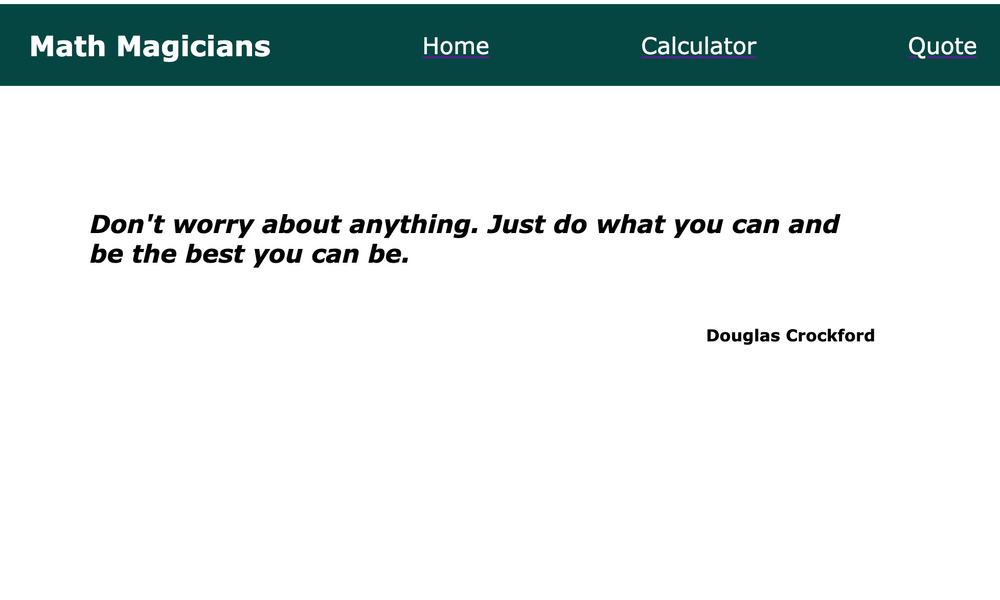

# Math Magicians App

> A calculator web app built with React.js

## Built With

- HTML
- CSS
- JavaScript
- React
- Webpack
- API

## Live Demo

- [Heroku Link](https://math-magicians-karelvanoordt.herokuapp.com/)
- [Netlify link](https://kind-williams-282257.netlify.app/)

## Getting Started

Download files or clone the current repository into your local environment.

### Prerequisites

- Have a web browser installed
- Have a Code Editor Installed (VSCode, Atom)

### Setup

run `npm install` to install modules in local environment

run `npm start` to run the app in server

## Authors

👤 **Karel van Oordt**

- GitHub: [@githubhandle](https://github.com/karelvanoordt)
- Twitter: [@twitterhandle](https://twitter.com/karelvanoordtEN)
- LinkedIn: [LinkedIn](https://linkedin.com/in/karelvanoordt)

👤 **Author2**

## 🤝 Contributing

Contributions, issues, and feature requests are welcome!

## Show your support

Give a ⭐️ if you like this project!

## 📝 License

This project is [MIT](./MIT.md) licensed.
